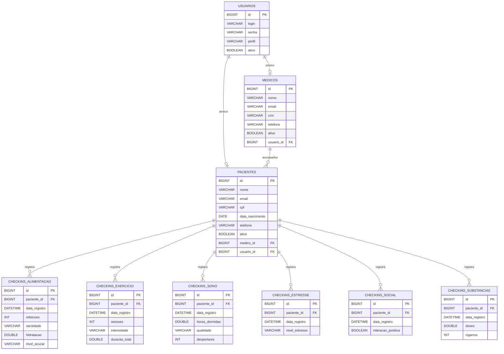

# CarePlus - Sprint 3 - API de Monitoramento de Estilo de Vida (MEV)

API REST para monitoramento de Mudanças no Estilo de Vida(MEV) de pacientes, permitindo o registro e acompanhamento de check-ins diários de alimentação, exercício, sono, estresse, interação social e uso de substâncias. Projetada para uso por médicos e pacientes.

## Integrantes do Grupo
Edson Leonardo Pacheco Navia | RM553737 
Eduardo Mazelli | RM553236 
Joseh Gabriel Trimboli Agra | RM553094 
Lucas Masaki Nagahama | RM553087 
Pedro Henrique de Assunção Lima | RM552746 

## Descrição do Projeto

O projeto é uma API desenvolvida com arquitetura hexagonal que centraliza o monitoramento de hábitos de saúde de pacientes. O sistema oferece:

- Cadastro e gerenciamento de médicos, pacientes e usuários
- Registro de check-ins em 6 pilares de estilo de vida
- Geração de relatórios e histórico por período
- Autenticação via JWT com controle de acesso baseado em perfis (ADMIN, MEDICO, PACIENTE)
- Validações de negócio automáticas nos check-ins (ex: risco de burnout, privação de sono, sedentarismo)

## Tecnologias Utilizadas

- Java 21
- Spring Boot 4.0.6
- Spring Security
- Spring Data JPA
- Hibernate
- MySQL
- JWT
- Flyway
- Lombok
- Jakarta Validation
- BCrypt

## Configuração e Execução

### 1. Clonar o repositório

git clone https://github.com/xMasaki/Sprint3__SOA.git  

### 2. Configurar o banco de dados
Crie o schema no MySQL:

CREATE DATABASE mev;  

### 3. Configurar variáveis de ambiente
Edite conforme seu ambiente:

spring.datasource.url=jdbc:mysql://localhost/mev  
spring.datasource.username=root 
spring.datasource.password=SUA_SENHA 

api.security.token.secret=${JWT_SECRET:12345678}  

### 4. Rodar os testes

Rode o aqruivo CarePlusApplicationTests para validar se está pronto para executar aplicação.  

### 5. Executar a aplicação

A API estará em http://localhost:8080  

### 6. Verificar funcionamento

GET http://localhost:8080/health-check
Resposta: MEV API - OK  

### Perfis de acesso
ADMIN - Acesso total ao sistema 
MEDICO - Gerencia pacientes e visualiza dados 
PACIENTE - Registra seus próprios check-ins  

## Exemplos de requisições e respostas

### Autenticação

#### POST /login

**Request:** 
{
  "login": "admin@careplus.com",
  "senha": "senha123"
}

**Response 200 OK:** 
{
  "token": "eyJhbGciOiJIUzI1NiIsInR5cCI6IkpXVCJ9..."
}  

### Usuários

#### POST /usuarios

**Request:** 
{
  "login": "joao@careplus.com",
  "senha": "senha123",
  "perfil": "MEDICO"
}

**Response 201 Created:** 
{
  "id": 1,
  "login": "joao@careplus.com",
  "perfil": "MEDICO"
}  

### Médicos

#### POST /medicos

**Request:** 
{
  "nome": "Dr. João Silva",
  "email": "dr.joao@careplus.com",
  "crm": "123456",
  "telefone": "11999999999",
  "usuarioId": 1
}

**Response 201 Created:** 
{
  "id": 1,
  "nome": "Dr. João Silva",
  "email": "dr.joao@careplus.com",
  "crm": "123456",
  "telefone": "11999999999"
}  

### Check-ins

#### POST /checkins/alimentacao

**Request:** 
{
  "idPaciente": 1,
  "dataRegistro": "2024-05-08T08:00:00",
  "refeicoes": 3,
  "saciedade": "SATISFEITO",
  "hidratacao": 2.5,
  "nivelAcucar": "MODERADO"
}  

#### POST /checkins/exercicio

**Request:** 
{
  "idPaciente": 1,
  "dataRegistro": "2024-05-08T07:00:00",
  "sessoes": 1,
  "intensidade": "MODERADA",
  "duracaoTotal": 45.0
}  

#### POST /checkins/sono

**Request:** 
{
  "idPaciente": 1,
  "dataRegistro": "2024-05-08T06:00:00",
  "horasDormidas": 7.5,
  "qualidade": "BOM",
  "despertares": 1
}  

#### POST /checkins/estresse

**Request:** 
{
  "idPaciente": 1,
  "dataRegistro": "2024-05-08T18:00:00",
  "nivelEstresse": "MODERADO"
}  

#### POST /checkins/social

**Request:** 
{
  "idPaciente": 1,
  "dataRegistro": "2024-05-08T19:00:00",
  "interacaoPositiva": true
}  

#### POST /checkins/substancias

**Request:** 
{
  "idPaciente": 1,
  "dataRegistro": "2024-05-08T20:00:00",
  "doses": 1.0,
  "cigarros": 0
}  

### Histórico e Relatórios

#### GET /relatorios/{1}?dataInicio=2024-05-01&dataFim=2024-05-31

**Response 200 OK:** 
{
  "idPaciente": 1,
  "alimentacao": { "mediaRefeicoes": 3.0, "mediaHidratacao": 2.3 },
  "exercicio": { "totalSessoes": 10, "mediaIntensidade": "MODERADA" },
  "sono": { "mediaHoras": 7.2, "qualidadeMedia": "BOM" },
  "estresse": { "nivelMedio": "MODERADO" },
  "social": { "percentualInteracoesPositivas": 85.0 },
  "substancias": { "mediaDoses": 0.5, "mediaCigarros": 0 }
}  

### Erros comuns

**Exemplo de erro 400:** 
{
  "campo": "email",
  "mensagem": "não deve ser nulo"
}   

## Diagrama de Entidades (ER)

